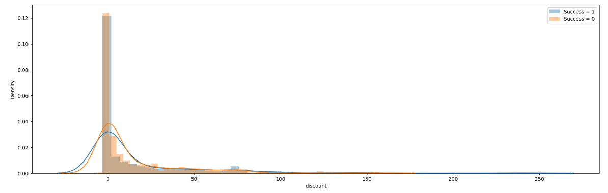
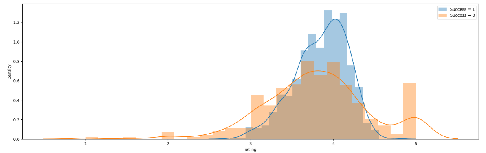
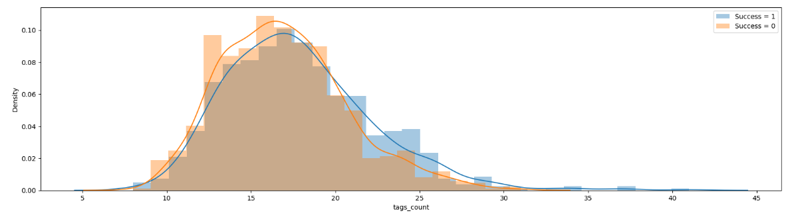
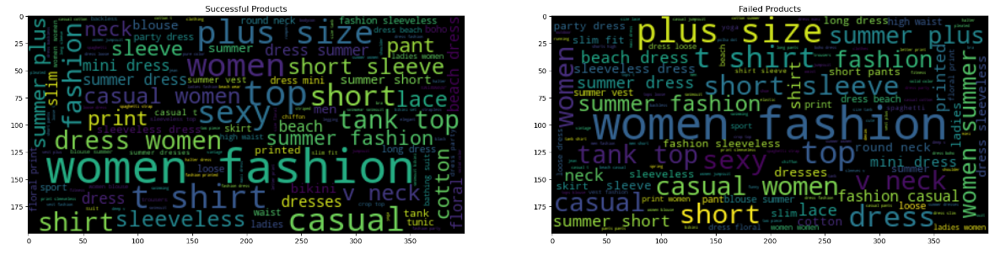
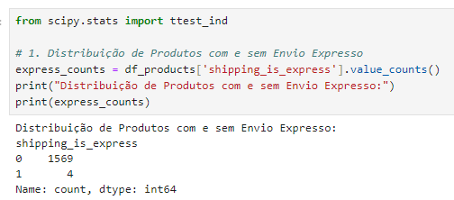
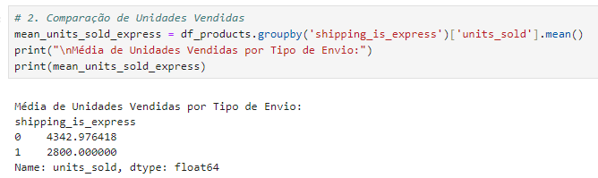
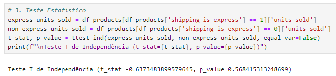
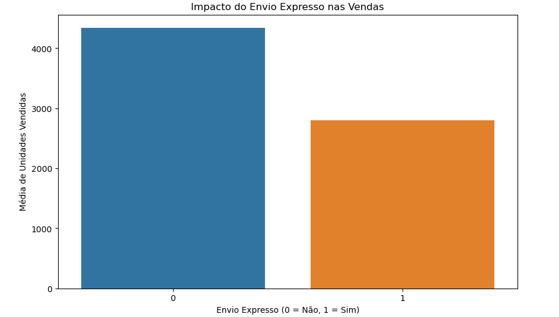

# Projeto - Análise Estratégica de Vendas e Performance em Marketplaces.

Este projeto realiza uma análise das vendas de produtos em um marketplace, com o objetivo de entender quais fatores influenciam nas vendas e fornecer insights valiosos para uma empresa que planeja vender produtos na plataforma.

## Introdução

Uma empresa está planejando revender produtos em um marketplace e deseja otimizar suas estratégias para maximizar as vendas. Este projeto tem como objetivo fornecer insights detalhados sobre os fatores que influenciam o desempenho de vendas dos produtos na plataforma.

## Algumas das perguntas que este projeto procura responder incluem:

- Produtos com maior discrepância entre o preço de varejo e o preço de venda vendem mais?
- AD Boost impactam nas vendas?
- Avaliações positivas impulsionam as vendas?
- Quais tags estão associadas a maiores vendas?
- O envio expresso impacta nas vendas?

## Metodologia

A análise foi conduzida utilizando Python e algumas bibliotecas de visualização de dados. A base de dados utilizada nesta análise foi obtida no site Kaggle. Os passos principais incluíram:

**Carregamento e Visualização dos Dados:**
- Realização de uma análise exploratória inicial para compreender a estrutura e as características dos dados.

**Limpeza e preparação dos dados:**
- Remoção de inconsistências e tratamento de valores ausentes.
- Preparação dos dados para análise, incluindo a normalização e transformação de variáveis.
- Exploração dos principais fatores que influenciam as vendas.

**Visualizações:**

- Criação de gráficos para entender melhor os padrões nos dados.

## Análise

**Produtos com maior discrepância entre preço de varejo e o preço de venda vendem mais?**

O gráfico apresenta a correlação entre a discrepância entre o preço de varejo e o preço de venda e a taxa de conversão das vendas. A discrepância é definida como a diferença entre o preço de varejo e o preço de venda, dividida pelo preço de varejo. A taxa de conversão das vendas é calculada como a proporção de vendas bem-sucedidas em relação ao total de vendas.

Observa-se no gráfico uma relação positiva entre a discrepância e a taxa de conversão das vendas. Este resultado indica que à medida que a discrepância aumenta, há um correspondente aumento na taxa de conversão das vendas.

Isso signifinica que produtos com maior discrepância de preço tendem a atrair mais consumidores devido à percepção de que estão obtendo um excelente negócio. Esses produtos frequentemente são destacados em promoções ou liquidações, beneficiando-se da disposição dos varejistas em reduzir os preços de itens com margens de lucro mais amplas. Além disso, a preferência por compras online aumenta a probabilidade de que produtos com preços mais baixos sejam vendidos, pois os consumidores têm maior propensão a comparar preços pela internet.

---

**Ad boost impactam nas vendas?**

Proporção de produtos não bem sucedidos e bem sucedidos que usam "ad boosts:

**Interpretação dos Resultados**

**Para os produtos não bem sucedidos:**

- 54.51% não usaram "Ad boosts".
- 45.49% usaram "ad boosts".

**Para os produtos bem sucedidos:**

- 59.03% não usaram "Ad boosts".
- 40.97% usaram "ad boosts".

Podemos notar que existe uma maior proporção de produtos bem sucedidos que não usaram ''Ad boosts'' (59.03%) comparado aos produtos não bem sucedidos (54.51%). Inversamente, uma menor proporção de produtos bem sucedidos usaram ''Ad boosts'' (40.97%) comparado aos produtos não bem sucedidos (45.49%). 

Portanto, o uso de ''Ad Boosts'' não está associado a um aumento no sucesso das vendas. Há uma ligeira tendência contrária, onde produtos que não usam ''Ad boosts'' têm uma proporção maior de sucesso.

---

**Avaliações positivas impulsionam as vendas?**

Observações do Gráfico:

- A distribuição dos produtos de sucesso é centrada em torno das avaliações de 4 a 5, com um pico mais alto na faixa de 4 a 4,5.

- A distribuição dos produtos que não tiveram sucesso mostra um pico menor em torno da avaliação de 3 a 4 e uma quantidade significativa de avaliações na faixa de 4,5 a 5.

**Produtos de sucesso tendem a ter avaliações mais altas:**

Nota-se no gráfico que a maior concentração de avaliações para produtos de sucesso está na faixa de 4 a 5, sugerindo que avaliações mais altas estão associadas a um maior sucesso nas vendas.

**Produtos que não tiveram sucesso ainda podem ter boas avaliações:**

É possível notar também produtos que não tiveram sucesso com avalições altas (acima de 4,5), indicando que uma boa avaliação não é garantia de sucesso absoluto, mas pode ser um fator contribuitivo.

Assim, avaliações positivas (altas) parecem, de fato, impulsionar as vendas de produtos, já que a maioria dos produtos bem-sucedidos têm avaliações mais altas. No entanto, outros fatores além das avaliações também podem influenciar o sucesso das vendas, pois existem produtos com boas avaliações que não tiveram sucesso.

---

**Quantidade de tags auxiliam vendas?**

Com base nesse insight, observamos que ter um número específico de tags (em torno de 10 a 15) pode estar associado a taxas de sucesso mais altas, conforme indicado pelo pico no histograma laranja. No entanto, há também uma quantidade significativa de produtos com 'Sucesso = 0' dentro dessa faixa, sugerindo que as tags podem auxiliar nas vendas até certo ponto, mas não são o único fator responsável pelo sucesso. Outros fatores também podem desempenhar um papel importante.

---

**Quais tags estão associadas a maiores vendas?**

Com base no gráfico, as tags associadas a maiores vendas são:

- “plus size”
- “women fashion”
- “casual”
- “dress”

Essas tags têm maior destaque no lado esquerdo do gráfico, indicando uma forte associação com produtos de sucesso.

---

**O envio expresso impacta nas vendas?**

Distribuição de Produtos com e sem Envio Expresso:

Isso indica que a maioria dos produtos (1569) não utilizam envio expresso, enquanto apenas 4 produtos utilizam envio expresso.

Média de Unidades Vendidas por Tipo de Envio:

A média de unidades vendidas para produtos sem envio expresso é 4342.98, enquanto a média para produtos com envio expresso é 2800.00.

Teste T de Independência:

O teste T de independência indica que a diferença nas médias de unidades vendidas entre produtos com e sem envio expresso não é estatisticamente significativa (p_value > 0.05).

Concluindo, a análise mostra que, embora os produtos embora os produtos sem envio expresso tenham uma média de unidades vendidas maior do que os produtos com envio expresso, essa diferença não é estatisticamente significativa. Isso sugere que, com base nos dados disponíveis, o envio expresso não tem um impacto significativo nas vendas.

## Conclusão

Com base na análise, foram identificados alguns fatores chave que influenciam nas vendas dos produtos no marketplace:

- Produtos com maior discrepância entre preço de varejo e de preço de venda tendem a vender mais.

- Ad boosts têm um impacto positivo nas vendas.

- Avaliações positivas estão associadas a um maior volume de vendas.

- A quantidade de tags também tem um efeito positivo nas vendas.
  
- Certas tags estão associadas a maiores vendas.
  
- O envio expresso não tem um impacto significativo nas vendas.

Estas conclusões podem ajudar a empresa a tomar decisões mais informadas sobre quais produtos revender e como otimizá-los para maximizar as vendas.

## Referência

 - https://www.kaggle.com/datasets/jmmvutu/summer-products-and-sales-in-ecommerce-wish
